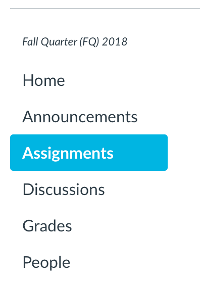

This tutorial shows how to *drop the lowest midterm* (or do some other 
comparable act of kindness) in Canvas. It is assumed you have a working 
Canvas website set up before starting this tutorial.

## Set Up Assignments in Groups

Go to "Assignments" in Canvas.

In Canvas, graded things (including 'exams') are called **assignments**. All
assignments belong to a **group**. For example, a class's assignments may 
be set up in the following way:

- Homework Assignments
    - Homework 1
    - Homework 2
    - Homework 3
    - Extra Credit Assignment
- Midterm Exams
    - Midterm 1
    - Midterm 2
- Final Exam
    - Final Exam
  
Here, the groups are 'Homework Assignments', 'Midterm Exams', and 
'Final Exam'. Notice that even though the *group* 'Final Exam' only has one 
assignment, that assignment must belong to a group. 

Kind of like putting a Noun Phrase node above a stand alone Noun, eh?!

## Add Rules and Weights to Groups

Once you have groups set up, you can assign **weights** and **rules** to 
groups.

## Check the Gradebook to Confirm Rules Are Applied

Assuming you have assignments made and scores entered, confirm the rules you 
made are applied by checking the Gradebook.

  Return to the [Github repository](https://github.com/captainalan/canvas-drop-lowest-score).

  Copyright (c) 2018 Alan Wong

